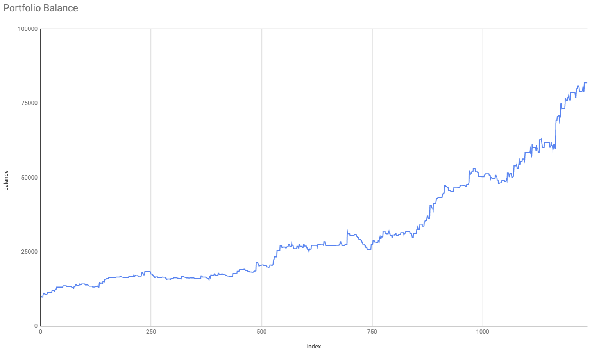

# Simple Cryptocurrency Breakout Strategy

Catch breakouts by opening positions based on previous day's range. Popularized by Larry Williams.

## Strategy

1. Check previous day for positive return
2. Set limit order based on previous day's range
3. Close position at end of day

See `config.ts` for strategy configuration

## Backtest

### Fetch historical data

Fetch 1min historical data from Binance. Uses public endpoints so keys are not required.  
Specify trading pairs in `config.ts`.

````bash
	@@ -27,3 +29,21 @@ Be sure to fetch historical data first.
```bash
npm run backtest
````

### Backtest Results

BTC `2017-12-01` to `2021-04-20`



These results are also from 1Min candles and not trades data which means some target and stoploss fills may be inaccurate.

```
leverage: 			1x
days:  				1237
return:  			719.38 %
annualized return:  86.01 %
max drawdown:  		-18.80 %
trades:  			371
benchmark:  		475.48 %
benchmark md:  		-84.03 %
```

```
leverage: 			3x
days:  				1237
return:  			21935.58 %
annualized return:  391.34 %
max drawdown:  		-47.30 %
trades:  			371
benchmark:  		475.48 %
benchmark md:  		-84.03 %
```

The model does not perform was well as a buy and hold strategy in a bull run but vastly outperforms in a bear market. However, with such a low maximum drawdown, these gains can easily be recouped with leverage. Using 3x-5x leverage will outperform a buy and hold in any environment.
