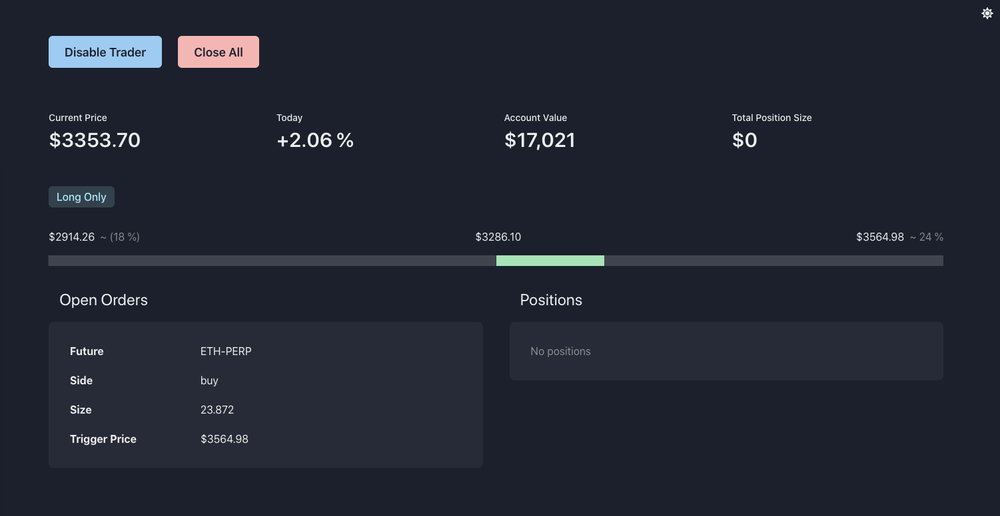

# Simple Cryptocurrency Breakout Strategy

Catch breakouts by opening positions based on the previous day's range. Popularized by Larry Williams.

## Strategy

1. Get previous day's high and low
2. Set limit order based on previous day's range
3. Close position at end of day

## Docker

Make sure to set `secret` and `key` in `config.json` or pass as env vars.  
See `Makefile`

```bash
> docker build breakout-trader .
> docker run -p 4000:4000 breakout-trader
```

Navigate to `http://localhost:4000` for dashboard

## Dashboard

The dashboard can be used to monitor your open orders and positions. The bot can also be disable and all positions and orders can be closed manually. Supports mobile view.

| Dashhoard                            |
| ------------------------------------ |
|  |
